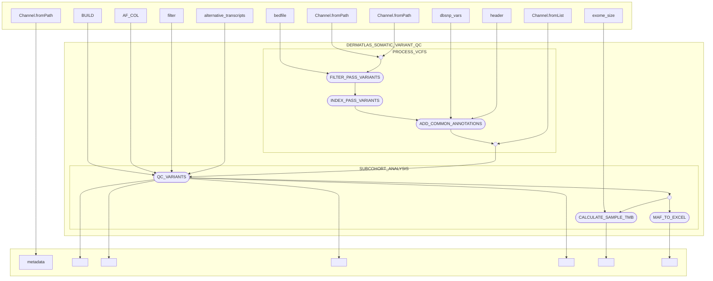

# dermatlas_somatic_qc_nf

[](https://www.nextflow.io/)
[](https://www.docker.com/)
[](https://sylabs.io/docs/)

## Introduction

dermatlas_somatic_qc_nf is a bioinformatics pipeline written in [Nextflow](http://www.nextflow.io) for performing processing and QC on somatic variant calls from cohorts of FFPE tumors within the Dermatlas project. 

## Pipeline summary

In brief, the pipeline takes the Caveman and Pindel VCF files for a set samples – which have been pre-processed by the Dermatlas ingestion pipeline – and then:
- Links each sample vcf to it's associated metadata.
- Filters `PASS` variants flagged by Caveman/Pindel from a variant set.
- Annotates variants that present in dbSNP 
- Performs Dermatlas variant-QC, variant filtering, and generates Dermatlas diagnostic plots 
- Calculates the TMB of Dermatlas `keep` samples produced by Dermatlas variant-QC
- Creates `.xlsx` file outputs from mafs for releasing to project scientists

## Inputs 

### Cohort-dependent variables

- `caveman_vcfs`: path to a set of Caveman vcf files (using **.vcf expansion)
- `pindel_vcfs`: path to a set of Pindel vcf files (using **.vcf expansion)
- `metadata_manifest`: path to a tab-delimited manifest containing information about sample phenotype and preparation. Required columns and allowed values are:
    - Sex: M or F
    - Sanger_DNA_ID: PDID of the sample (e.g. PD001234)
    - OK_to_analyse_DNA?: Y or N
    - Phenotype: T or N
- `cohort_prefix`: Prefix to add to output file names
- `exome_size`: Size in Mb of the baitset (for Dermatlas this is `48.225157`)
- `outdir`: Directory to publish results 
- `caveman_outdir`: Directory to publish the results of variant processing to match Dermatlas conventions (typically the `analysis` dir for a publishable unit).
- `pindel_outdir`: Directory to publish the results of variant processing to match Dermatlas conventions (typically the `analysis` dir for a publishable unit).
- `release_version`: Directory to release results into within an output directory (e.g.`version1`)

**Subcohorts**
- `subcohorts`: A map of subcohort names to their configuration. Each subcohort entry should have a `sample_list` property pointing to a TSV file containing tumor-normal pairs. Example:
```groovy
subcohorts = [
    "all": [
        sample_list: "/path/to/all_matched_pairs.tsv"
    ],
    "one_per_patient": [
        sample_list: "/path/to/one_tumour_per_patient_pairs.tsv"
    ],
    "independent": [
        sample_list: "/path/to/independent_pairs.tsv"
    ]
]
```

**Optional**
- `alternative_transcripts`: path to a file containing a tab-delimited list of HUGO gene symbol - transcript ID pairs for correcting the transcript considered canonical.


### Reference variables
Reference files that are reused across pipeline executions have been placed within the pipeline's default `nextflow.config` file to simplify configuration and can be ommited from setup. Behind the scences, the following reference files are required for a run: 
- `dbsnp_variants`: path to DBSNP vcf file and it's `.tbi` index file (`dbSNP155_common.tsv.gz{,.tbi}`)
- `dbsnp_header`: Path to a file detailing dbsnp header info
- `genome_build`: Genome build string (`GRCh38`) to use in somatic QC steps
- `filtering_column`: Column within VCF to use in filtering likely germline variants (default: `gnomAD_AF`)
- `filter_option`: String to determine the mode of filter applied to variants (One of `filter1` or `filter2`)

Default reference file values supplied within the `nextflow.config` file can be overided by adding them to the params `.json` file. An example complete params file `example_params.json` is supplied within this repo for demonstation.

## Usage 

The recommended way to launch this pipeline is using a wrapper script (e.g. `bsub < my_wrapper.sh`) that submits nextflow as a job and records the version (**e.g.** `-r 1.0.0`)  and the `.config` file supplied for a run.

An example wrapper script:
```
#!/bin/bash
#BSUB -q oversubscribed
#BSUB -G team113-grp
#BSUB -R "select[mem>8000] rusage[mem=8000] span[hosts=1]"
#BSUB -M 8000
#BSUB -oo logs/somatic_variants_pipeline_%J.o
#BSUB -eo logs/somatic_variants_pipeline_%J.e

export CONFIG_FILE="commands/example_config.json"
export REVISION="1.0.0"

# Load module dependencies
module load nextflow-23.10.0
module load /software/modules/ISG/singularity/3.11.4

# Create a nextflow job that will spawn other jobs

nextflow run 'https://github.com/team113sanger/dermatlas_somatic_qc_nf' \
-r ${REVISION} \
-c ${CONFIG_FILE} \
-profile farm22 
```


When running the pipeline for the first time on the farm you will need to provide credentials to pull singularity containers from the team113 sanger gitlab. You should be able to do this by running
```
module load singularity/3.11.4 
singularity remote login --username $(whoami) docker://gitlab-registry.internal.sanger.ac.uk
```

The pipeline can configured to run on either Sanger OpenStack secure-lustre instances or farm22 by changing the profile speicified:
`-profile secure_lustre` or `-profile farm22`. 

## Pipeline visualisation
Created using nextflow's in-built visualisation features.
```
nextflow run main.nf -preview -with-dag flowchart.mmd -params-file tests/testdata/test_params.json -c tests/nextflow.config -profile testing -stub
```



## Testing

This pipeline has been developed with the [nf-test](http://nf-test.com) testing framework. Unit tests and small test data are provided within the pipeline `test` subdirectory. A snapshot has been taken of the outputs of most steps in the pipeline to help detect regressions when editing. You can run all tests on openstack with:

```
nf-test test 
```
and individual tests with:
```
nf-test test tests/modules/x.nf.test
```

For faster testing of the flow of data through the pipeline **without running any of the tools involved**, stubs have been provided to mock the results of each succesful step.
```
nextflow run main.nf \
-params-file params.json \
-c tests/nextflow.config \
--stub-run
```


