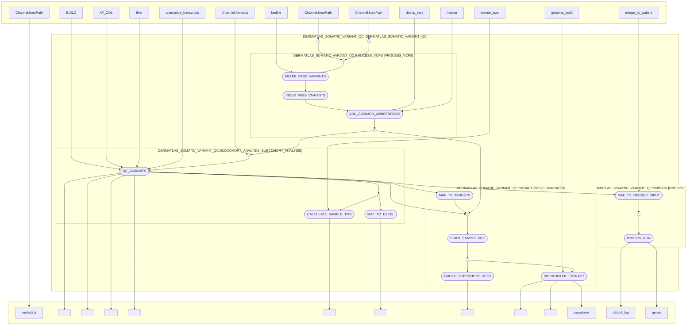

# dermatlas_somatic_qc_nf

[](https://www.nextflow.io/)
[](https://www.docker.com/)
[](https://sylabs.io/docs/)

## Introduction

dermatlas_somatic_qc_nf is a bioinformatics pipeline written in [Nextflow](http://www.nextflow.io) for performing processing and QC on somatic variant calls from cohorts of FFPE tumors within the Dermatlas project. 

## Pipeline summary

In brief, the pipeline takes the Caveman and Pindel VCF files for a set samples – which have been pre-processed by the Dermatlas ingestion pipeline – and then:
- Links each sample vcf to it's associated metadata.
- Filters `PASS` variants flagged by Caveman/Pindel from a variant set.
- Annotates variants that present in dbSNP 
- Performs Dermatlas variant-QC, variant filtering, and generates Dermatlas diagnostic plots 
- Calculates the TMB of Dermatlas `keep` samples produced by Dermatlas variant-QC
- Creates `.xlsx` file outputs from mafs for releasing to project scientists
- Optionally extracts mutational signatures per subcohort with SigProfilerExtractor (SBS/DBS from Caveman, ID from Pindel)
- Optionally runs dNdScv per subcohort for significantly mutated gene discovery (with and without epigenomic covariates)

## Inputs 

### Cohort-dependent variables

- `caveman_vcfs`: path to a set of Caveman vcf files (using **.vcf expansion)
- `pindel_vcfs`: path to a set of Pindel vcf files (using **.vcf expansion)
- `metadata_manifest` (optional; not read by any step yet, but checked for existence when set): path to a tab-delimited manifest containing information about sample phenotype and preparation. Required columns and allowed values are:
    - Sex: M or F
    - Sanger_DNA_ID: PDID of the sample (e.g. PD001234)
    - OK_to_analyse_DNA?: Y or N
    - Phenotype: T or N
- `cohort_prefix`: Prefix to add to output file names
- `exome_size`: Size in Mb of the baitset (for Dermatlas this is `48.225157`)
- `outdir`: Directory to publish results 
- `caveman_outdir`: Directory to publish the results of variant processing to match Dermatlas conventions (typically the `analysis` dir for a publishable unit).
- `pindel_outdir`: Directory to publish the results of variant processing to match Dermatlas conventions (typically the `analysis` dir for a publishable unit).
- `release_version`: Directory to release results into within an output directory (e.g.`version1`)

**Subcohorts**
- `subcohorts`: A map of subcohort names to their configuration. Each subcohort entry should have a `sample_list` property pointing to a TSV file containing tumor-normal pairs. A sample list may be empty, in which case that subcohort produces no outputs. Example:
```groovy
subcohorts = [
    "all": [
        sample_list: "/path/to/analysed_all.tsv"
    ],
    "onePerPatient": [
        sample_list: "/path/to/one_tumour_per_patient_all.tsv"
    ],
    "independent": [
        sample_list: "/path/to/independent_tumours_all.tsv"
    ],
    "related": [
        sample_list: "/path/to/related_tumours_all.tsv"
    ]
]
```

**Optional**
- `alternative_transcripts`: path to a file containing a tab-delimited list of HUGO gene symbol - transcript ID pairs for correcting the transcript considered canonical.
- `run_signatures`: toggle the SigProfilerExtractor signature-calling subworkflow (default: `true`).
- `sigprofiler_outdir`: output directory for signature-calling results. Kept separate from `outdir` to follow the Dermatlas convention `${PROJECT_DIR}/analysis/sigprofiler`.
- `sigprofiler_seed`: path to an optional SigProfiler `Seeds.txt` file for reproducible re-runs.
- `sigprofiler_subcohort_names`: map of subcohort key → publish-dir name for SigProfiler outputs (default maps `onePerPatient` → `one_tumour_per_patient`, `independent` → `independent_tumours`, `related` → `related_tumours`, `all` → `all_tumours` to match the manual analysis layout). Unmapped keys fall back to the raw key.
- `run_dndscv`: toggle the dNdScv significantly-mutated-genes subworkflow (default: `true`).
- `dndscv_outdir`: output directory for dNdScv results. Kept separate from `outdir` to follow the Dermatlas convention `${PROJECT_DIR}/analysis/dndscv`.
- `dndscv_refdb`: path to the dNdScv reference CDS `.rda` file (e.g. `RefCDS_human_GRCh38_GencodeV18_recommended.rda`). Required when `run_dndscv = true`. Defaulted on `farm22`.
- `dndscv_covariates`: optional path to a covariates `.rda` file (e.g. `covariates_hg19_hg38_epigenome_pcawg.rda`). When set, dNdScv is run twice per subcohort (with and without covariates); when unset, only the without-covariates mode is run. Defaulted on `farm22`.
- `dndscv_merge_by_patient`: if `true`, variants from sibling tumours sharing a PDXXXX patient prefix are merged prior to running dNdScv (default: `true`).
- `dndscv_subcohort_names`: map of subcohort key → publish-dir name for dNdScv outputs (same defaults as `sigprofiler_subcohort_names`).


### Reference variables
Reference files that are reused across pipeline executions have been placed within the pipeline's default `nextflow.config` file to simplify configuration and can be ommited from setup. Behind the scences, the following reference files are required for a run: 
- `dbsnp_variants`: path to DBSNP vcf file and it's `.tbi` index file (`dbSNP155_common.tsv.gz{,.tbi}`)
- `dbsnp_header`: Path to a file detailing dbsnp header info
- `genome_build`: Genome build string (`GRCh38`) to use in somatic QC steps
- `filtering_column`: Column within VCF to use in filtering likely germline variants (default: `gnomAD_AF`)
- `filter_option`: String to determine the mode of filter applied to variants (One of `filter1` or `filter2`)

Default reference file values supplied within the `nextflow.config` file can be overided by adding them to the params `.json` file. An example complete params file `example_params.json` is supplied within this repo for demonstation.

## Usage

Whether launched via the integrated website or manually, the pipeline is submitted the same way: `run_somatic_variants.sh` is piped into `bsub` as the
job script.

```bash
bsub -o "<stdout_log>" -e "<stderr_log>" \
     -g "<lsf_job_group>" -J "<job_name>" \
     < <dir>/run_somatic_variants.sh
```

Queue, resource group and memory come from the `#BSUB` directives inside the wrapper, so `bsub` adds only the job
name, job group and log paths. It is an ordinary bash script, so `bash run_somatic_variants.sh` also runs it in the
foreground on any farm node - the `#BSUB` lines are inert comments; `bsub` only makes it a batch job. Either way
it sources `./source_me.sh` relative to the directory it was started from.

Nearly all runs are triggered from the [Dermatlas cohorts page](https://team113.sanger.ac.uk/dermatlas/cohorts/),
which issues that command remotely against a project directory it has already provisioned - `source_me.sh`,
`run_somatic_variants.sh` and `somatic_variants.config` are all written for you. There is nothing to do by hand.

### Without the website

Clone the repo and supply what the website otherwise provisions: a project directory, the pipeline's
environment, and a couple of edits to the wrapper.

The config globs `${ANALYSIS_DIR}/caveman_files/**.smartphase.vep.vcf.gz` and
`${ANALYSIS_DIR}/pindel_files/**.pindel.vep.vcf.gz`, so VCFs may sit at any depth below those directories. See
[Inputs](#cohort-dependent-variables) for the sample-list and metadata formats.

```
<project_dir>/                                   # PROJECT_DIR
├── metadata/
│   ├── 6740_3016-analysed_all.tsv               # every analysed tumour, matched or not
│   ├── 6740_3016-independent_tumours_all.tsv
│   ├── 6740_3016-one_tumour_per_patient_all.tsv
│   ├── 6740_3016-related_tumours_all.tsv        # may be empty
│   └── cohort_metadata.tsv                      # patient metadata manifest (optional)
├── analysis/                                    # ANALYSIS_DIR; results land here
│   ├── caveman_files/<sample>/*.smartphase.vep.vcf.gz
│   └── pindel_files/<sample>/*.pindel.vep.vcf.gz
└── somatic_pipe/                                # created by the wrapper, not by you
    ├── .lock                                    # see Reclaiming disk space
    ├── .completed_successfully                  #   "
    ├── work/                                    # deleted after a successful run
    └── tmp/
```

The environment itself can come from a `source_me.sh` or from the wrapper directly. Both are supported; pick one.

<details>
<summary><strong>With a <code>source_me.sh</code></strong> - reusable across runs, and the shape the website generates</summary>

1. Write `source_me.sh` beside the wrapper in `assets/`, which is where the wrapper looks by default. With
   reporting opted out, these ten exports are the whole contract (`COHORT_METADATA_FILE` is optional):

   ```bash
   export PROJECT_DIR="/lustre/.../6740_3016_MY_COHORT_WES"
   export COMMANDS_DIR="${PROJECT_DIR}/commands"
   export ANALYSIS_DIR="${PROJECT_DIR}/analysis"
   export STUDY="6740"          # prefixes output filenames, and the run id
   export PROJECT="3016"        # prefixes output filenames, and the run id
   export COHORT="MY_COHORT"    # ends the output filename prefix
   export DNA_PAIR_LIST_ANALYSED_ALL="${PROJECT_DIR}/metadata/6740_3016-analysed_all.tsv"
   export DNA_PAIR_LIST_INDEPENDENT_TUMOURS_ALL="${PROJECT_DIR}/metadata/6740_3016-independent_tumours_all.tsv"
   export DNA_PAIR_LIST_ONE_TUMOUR_PER_PATIENT_ALL="${PROJECT_DIR}/metadata/6740_3016-one_tumour_per_patient_all.tsv"
   export DNA_PAIR_LIST_RELATED_TUMOURS_ALL="${PROJECT_DIR}/metadata/6740_3016-related_tumours_all.tsv"  # may be empty
   export COHORT_METADATA_FILE="${PROJECT_DIR}/metadata/cohort_metadata.tsv"  # optional; metadata_manifest
   ```

2. In the wrapper, under **OPT-IN REPORTING** set `DERMATLAS_WEBSITE_LOGGING` and
   `DERMATLAS_SLACK_NOTIFICATIONS` to `"false"`, and under **RUN CONFIGURATION** point `CONFIG` at your
   `somatic_variants.config` and set `REVISION` to the release tag to run.

3. Submit from the directory holding `source_me.sh`:

   ```bash
   cd dermatlas_somatic_qc_nf/assets
   bsub -o run.out -e run.err -J "somatic-<cohort>" < run_somatic_variants.sh
   ```

To override a single value without regenerating the file, uncomment just that variable in the wrapper's
**MANUAL ENVIRONMENT OVERRIDES** block - it is read after `source_me.sh`, so it wins.

</details>

<details>
<summary><strong>By editing <code>run_somatic_variants.sh</code> directly</strong> - self-contained, nothing to track outside the script</summary>

1. Under **ENVIRONMENT SETUP**, set `SOURCE_ME="none"` so the wrapper skips sourcing anything.

2. Under **MANUAL ENVIRONMENT OVERRIDES**, uncomment and fill in the pipeline-essential exports - the same
   ten listed in the `source_me.sh` route above.

3. Under **OPT-IN REPORTING** set `DERMATLAS_WEBSITE_LOGGING` and `DERMATLAS_SLACK_NOTIFICATIONS` to
   `"false"`, and under **RUN CONFIGURATION** point `CONFIG` at your `somatic_variants.config` and set
   `REVISION` to the release tag to run.

4. Submit from anywhere - with `SOURCE_ME="none"` there is no `source_me.sh` to be beside:

   ```bash
   bsub -o run.out -e run.err -J "somatic-<cohort>" < dermatlas_somatic_qc_nf/assets/run_somatic_variants.sh
   ```

The same block is the annotated master list for either route - every variable with its purpose and an example
value, including the website- and Slack-only ones you would add if you opted back in.

</details>

`somatic_variants.config` reads these same variables, so it needs no editing unless you want different
`subcohorts` or reference files. `REVISION` is fetched from GitHub, so your clone supplies the wrapper and config,
not the pipeline code - local edits to the workflow are not picked up until released.

The header of [`assets/run_somatic_variants.sh`](assets/run_somatic_variants.sh) maps every section and marks the
`[edit]` blocks, which are the only places you should need to touch.

### Toggles

| Variable | Default | Effect when `false` |
| --- | --- | --- |
| `DERMATLAS_WEBSITE_LOGGING` | `true` | no analysis-log record is written to the Dermatlas website |
| `DERMATLAS_SLACK_NOTIFICATIONS` | `true` | no Slack message on completion or failed launch |
| `DERMATLAS_CLEANUP_WORK_DIR` | `true` | this run's work directory is kept instead of deleted |

Work-directory cleanup only ever happens after a **successful** run; a failed one always keeps its work
directory, and so does one stopped by `bkill` or an LSF limit - `DERMATLAS_CLEANUP_WORK_DIR` is not consulted
unless the run succeeded. Cleanup relies on `params.publish_dir_mode = 'copy'`, and only ever removes the `work/` directory
the wrapper itself created.

None are required. Each is resolved from the environment, most specific first - a shell export beats
`source_me.sh`, which beats the default under **OPT-IN REPORTING** - so a single run can opt out without
editing anything:

```bash
export DERMATLAS_CLEANUP_WORK_DIR=false
bsub -o run.out -e run.err -J "somatic-<cohort>" < run_somatic_variants.sh
```

`true/false`, `yes/no`, `on/off` and `1/0` are all accepted in any case; anything else fails the launch
immediately rather than part-way through.

### Reclaiming disk space

`work/` and `tmp/` are the bulk of a cohort's disk and inode use, and are usually deleted by a separate clean-up
script you run yourself rather than by the wrapper. So the wrapper leaves three dot-files in
`${PROJECT_DIR}/<pipeline_slug>/` that let such a script tell a live run from a finished one - **including a run
started by a different user, with no LSF tools involved**.

<details>
<summary><strong>The artefacts, and how to delete safely around them</strong></summary>

| Artefact | Meaning |
| --- | --- |
| `.lock` | created once and **never removed**. Its presence says only that this directory uses the scheme. It never means a run is live. |
| `.completed_successfully` | the last run finished successfully |
| `.completed_with_error` | the last run reached a conclusion and failed - `bkill` and LSF limit kills included |

Liveness is not a file. It is an exclusive `flock` held on `.lock` for as long as the wrapper owns the directory,
and the kernel releases it when the process dies by any means, including `kill -9` and a node crash. So there is
never a stale lock to clear - and `.lock` must never be deleted, because unlinking it lets the next run lock a
fresh inode and exclude nobody.

Both sentinels are cleared when a run starts and exactly one is written when it ends, so their absence is a
truthful "no verdict for what is on disk right now".

A second submission of a cohort while one is already running fails immediately with exit 75, naming the holder.
That is deliberate: both runs would otherwise share one `work/`, and the first to finish would delete it under
the second.

#### Reading the state

| State | `flock -n` | `.completed_successfully` | `.completed_with_error` |
| --- | --- | --- | --- |
| running now | busy | - | - |
| succeeded | free | yes | - |
| failed, incl. `bkill`ed | free | - | yes |
| died mid-run (`kill -9`, node crash) | free | - | - |

`flock -n <file> <command>` takes the lock, runs the command, and releases it - or, if something else already
holds the lock, runs nothing at all and exits with the code given to `-E`. So a check and a deletion are the same
one-liner with a different command on the end:

```bash
p="${PROJECT_DIR}/somatic_pipe"

# 1. Is a run using this directory? `true` does nothing, so this only reports.
if flock -n -E 75 "$p/.lock" true; then
    echo "free - nothing is using $p"
else
    echo "RUNNING - held by:"; cat "$p/.lock"
fi

# 2. Move the work directory, but only if nothing is using it. The lock is held
#    for as long as the mv takes, so a run cannot start underneath it.
flock -n -E 75 "$p/.lock" mv "$p/work" /path/to/to_delete/
echo $?   # 0 = moved.  75 = a run owns it, and nothing was touched.
```

Testing the lock needs only **read** permission on `.lock`, so this works against another user's running
pipeline. Moving their `work/` afterwards still needs write permission on their pipeline directory.

Take the lock across both the decision and the move, never test-then-move, and require `.lock` to exist first:
on a directory that pre-dates this scheme `flock` would create one and report a live run as idle. **Neither
sentinel present means "died mid-run", never "succeeded"**; never unlink or replace `.lock`; and if the pipeline
directory is on a filesystem not mounted with `flock` (Lustre `localflock`, NFS `local_lock=`) the lock is
node-local and a sweep running elsewhere will not see it - the wrapper warns about this at launch, but a script
that deletes data should check `findmnt -T "$p" -no FSTYPE,OPTIONS` itself and refuse. The
[copy number pipeline README](https://github.com/team113sanger/dermatlas_copy_number_nf#reclaiming-disk-space)
has a complete sweep script that covers every Dermatlas pipeline directory.

</details>

### Container registry

When running the pipeline for the first time on the farm you will need to provide credentials to pull singularity containers from the team113 sanger gitlab. You should be able to do this by running
```
module load singularity/3.11.4 
singularity remote login --username $(whoami) docker://gitlab-registry.internal.sanger.ac.uk
```

The pipeline can configured to run on either Sanger OpenStack secure-lustre instances or farm22 by changing the profile speicified:
`-profile secure_lustre` or `-profile farm22`. 

## Pipeline visualisation
Created using nextflow's in-built visualisation features.
```
nextflow run main.nf -preview -with-dag flowchart.mmd -params-file tests/testdata/test_params.json -c tests/nextflow.config -profile testing -stub
```


```mermaid
flowchart TB
    subgraph " "
    v0["Channel.fromPath"]
    v2["Channel.fromPath"]
    v4["Channel.fromPath"]
    v7["bedfile"]
    v10["dbsnp_vars"]
    v11["header"]
    v14["Channel.fromList"]
    v32["BUILD"]
    v33["AF_COL"]
    v34["filter"]
    v35["alternative_transcripts"]
    v42["exome_size"]
    v64["genome_build"]
    v69["merge_by_patient"]
    end
    subgraph " "
    v1["metadata"]
    v37[" "]
    v38[" "]
    v39[" "]
    v40[" "]
    v44[" "]
    v46[" "]
    v63[" "]
    v66[" "]
    v67[" "]
    v68["signatures"]
    v73["stdout_log"]
    v74["genes"]
    end
    subgraph "DERMATLAS_SOMATIC_VARIANT_QC [DERMATLAS_SOMATIC_VARIANT_QC]"
    subgraph "DERMATLAS_SOMATIC_VARIANT_QC:PROCESS_VCFS [PROCESS_VCFS]"
    v8(["FILTER_PASS_VARIANTS"])
    v9(["INDEX_PASS_VARIANTS"])
    v12(["ADD_COMMON_ANNOTATIONS"])
    v6(( ))
    v13(( ))
    end
    subgraph "DERMATLAS_SOMATIC_VARIANT_QC:SUBCOHORT_ANALYSIS [SUBCOHORT_ANALYSIS]"
    v36(["QC_VARIANTS"])
    v43(["CALCULATE_SAMPLE_TMB"])
    v45(["MAF_TO_EXCEL"])
    v15(( ))
    v41(( ))
    end
    subgraph "DERMATLAS_SOMATIC_VARIANT_QC:SIGNATURES [SIGNATURES]"
    v47(["MAF_TO_TARGETS"])
    v59(["BUILD_SAMPLE_VCF"])
    v62(["GROUP_SUBCOHORT_VCFS"])
    v65(["SIGPROFILER_EXTRACT"])
    v48(( ))
    v60(( ))
    end
    subgraph "DERMATLAS_SOMATIC_VARIANT_QC:DNDSCV [DNDSCV]"
    v70(["MAF_TO_DNDSCV_INPUT"])
    v72(["DNDSCV_RUN"])
    v71(( ))
    end
    v3(( ))
    v5(( ))
    end
    v0 --> v1
    v2 --> v3
    v4 --> v5
    v7 --> v8
    v6 --> v8
    v8 --> v9
    v9 --> v12
    v10 --> v12
    v11 --> v12
    v12 --> v13
    v14 --> v15
    v32 --> v36
    v33 --> v36
    v34 --> v36
    v35 --> v36
    v15 --> v36
    v36 --> v40
    v36 --> v39
    v36 --> v47
    v36 --> v38
    v36 --> v37
    v36 --> v70
    v36 --> v41
    v36 --> v48
    v42 --> v43
    v41 --> v43
    v43 --> v44
    v41 --> v45
    v45 --> v46
    v47 --> v48
    v48 --> v59
    v59 --> v60
    v60 --> v62
    v62 --> v63
    v64 --> v65
    v60 --> v65
    v65 --> v68
    v65 --> v67
    v65 --> v66
    v69 --> v70
    v70 --> v71
    v71 --> v72
    v72 --> v74
    v72 --> v73
    v3 --> v6
    v5 --> v6
    v13 --> v15
    v13 --> v48
```

## Testing

This pipeline has been developed with the [nf-test](http://nf-test.com) testing framework. Unit tests and small test data are provided within the pipeline `test` subdirectory. A snapshot has been taken of the outputs of most steps in the pipeline to help detect regressions when editing. You can run all tests on openstack with:

```
nf-test test 
```
and individual tests with:
```
nf-test test tests/modules/x.nf.test
```

For faster testing of the flow of data through the pipeline **without running any of the tools involved**, stubs have been provided to mock the results of each succesful step.
```
nextflow run main.nf \
-params-file params.json \
-c tests/nextflow.config \
--stub-run
```

## Cutting a release

Cutting a new release requires a new semantic version tag, a changelog entry and
a commit of the updated version in every file that records it.

### One-off setup, per clone

Releases go through `git hf` (HubFlow). If it is not on your `PATH`, `module load git`.
In a fresh clone, enable it once:

```bash
git hf init   # writes this clone's hubflow branch/prefix config; the defaults are correct
```

That is the only setup required.

### Steps

1. `git hf release start <version>`
2. `./.update-version.sh <version>` — sets the semantic version in every file that
   records it (`assets/run_somatic_variants.sh`, `docs/source/conf.py`, `nextflow.config`).
   Run `./.update-version.sh --help` for details. Commit the changes.
3. Update `CHANGELOG.md` and commit it.
4. `git hf release finish <version>`


## Asset release bundles

`assets/` is published to GitHub Releases as `projectify_asset_bundle.tar.gz` (plus a
`.sha256` of it) by `.github/workflows/publish-assets.yml`, so `dermanager projectify` can
fetch the files straight from the release CDN - no API call, no token, no rate limit:

```
https://github.com/team113sanger/dermatlas_somatic_qc_nf/releases/download/<ref>/projectify_asset_bundle.tar.gz
```

| `<ref>` | Bundle contents | Updated |
| --- | --- | --- |
| `X.Y.Z` | `assets/` at that release tag | once, then immutable |
| `main-latest` | `assets/` at the head of `main`, i.e. the latest released state | every push to `main` |
| `develop-latest` | `assets/` at the head of `develop` | every push to `develop` |

The two `-latest` refs are fixed tags on pre-releases. Each push replaces the bundle attached
to the tag, so the download URL never changes and always serves that branch's current assets.
`releases/latest/download/...` is deliberately not used - it resolves only to the newest
non-pre-release, so it cannot address the rolling channels.

This repository is GitHub-primary. It was previously GitLab-primary and push-mirrored to
GitHub; that mirror was retired and the GitLab project archived. To publish a bundle for a
ref that predates the workflow, run it by hand from the GitHub Actions tab (*Publish
projectify asset bundle* -> *Run workflow*) with `ref` set to the tag or branch to build from.
